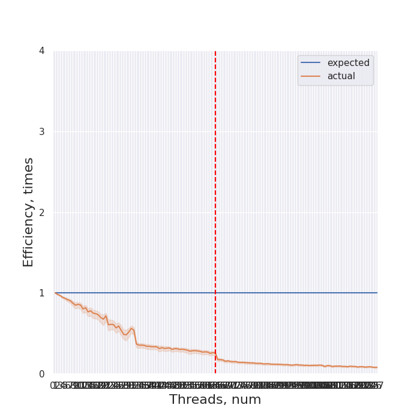

# НИЯУ МИФИ. Лабораторная работа №1. Мищенко Тимофей, Б20-505. 2022

## Система

### Характеристики процессора:
```
CPU:
  Info: 2x 16-core model: Intel Xeon (Icelake) bits: 64 type: MT MCP SMP cache: L2: 2x 64 MiB
    (128 MiB)
  Speed (MHz): avg: 1995 min/max: N/A cores: 1: 1995 2: 1995 3: 1995 4: 1995 5: 1995 6: 1995
    7: 1995 8: 1995 9: 1995 10: 1995 11: 1995 12: 1995 13: 1995 14: 1995 15: 1995 16: 1995 17: 1995
    18: 1995 19: 1995 20: 1995 21: 1995 22: 1995 23: 1995 24: 1995 25: 1995 26: 1995 27: 1995
    28: 1995 29: 1995 30: 1995 31: 1995 32: 1995 33: 1995 34: 1995 35: 1995 36: 1995 37: 1995
    38: 1995 39: 1995 40: 1995 41: 1995 42: 1995 43: 1995 44: 1995 45: 1995 46: 1995 47: 1995
    48: 1995 49: 1995 50: 1995 51: 1995 52: 1995 53: 1995 54: 1995 55: 1995 56: 1995 57: 1995
    58: 1995 59: 1995 60: 1995 61: 1995 62: 1995 63: 1995 64: 1995
```

### Характеристики памяти:
```
Machine:
  Type: Kvm Mobo: Yandex model: xeon-gold-6338 v: pc-q35-yc-2.12 serial: <superuser required>
    BIOS: SeaBIOS v: 1.11.1-1 date: 04/01/2014
```

### Версия gcc:
```
gcc (Ubuntu 11.2.0-19ubuntu1) 11.2.0
```

### Версия OpenMP:
```
OpenMP 4.5
```

### Остальные Характеристики
```
5.15.0-47-generic x86_64
```

## Оценка алгоритма

### Блок-схема


### Принцип работы
Приведенный алгоритм итерируется по массиву чисел и сравнивает их с текущим для данного потока 
максимальным элементом - max. Если элемент оказывается больше чем max, то max присваивается значение
этого элемнта, иначе не присваивается. После выполнения итерационной части потока,
полученное внутри потока значение max сравнивается с max из shared области и из них
выбирается наибольший. В итоге наибольший элемент будет в переменной max из shared области. 

### Оценка сложности алгоритмы

$p$ - количество используемых потоков  
$n$ - длина обрабатываемой последовательности

Тогда, сложность алгоритма - $O(\frac{n}{p})$; в частности, при $p = 1$, сложность - $O(n)$.

Теоретическое, ускорение работы программы - $p$.

### Директивы OpenMP
`#pragma omp parallel num_threads(threads) shared(array, count) reduction(max: max) default(none)`  
Объявляется параллельная обасть, с количеством потоков `threads`. Переменные `array` и `count`
объявляются общими для всех потокв и непараллельной части алгоритма. Все новые переменные без явного
указания класса не разрешены.  
Область - цикл for.
Если бы ее не было то цикл просто выполнился бы последовательно.

`#pragma omp for`
Задается директива относящаяся к циклу for идущему сразу после нее, выполняется распараллеливагие цикла с дефолтным значением schedule.
Область - цикл for
Если бы ее не было то цикл выполнился бы `n_threads` раз, каждый раз находя один и тот же максимальный элемент.

### Экспериментальные данные

Время работы программы при различном количестве потоков


Ускорение работы программы по сравнению с однопоточной версией


Эффективность работы программы



## Выводы
На устройстве, на котором проходило тестирование - 4 физических ядра, из-за чего значительный
прирост программа показывает только при использовании 2 потоков. Вплоть до 8 потоков скорость выполнения
уменьшается, но с сильным отрывом от теоретической скорости выполнения. Использование больше чем 8 потоков 
не дает прироста в скорости выполнения программы.

## Исходный код

```c 
#include <omp.h>
#include <stdio.h>
#include <stdlib.h>

void randomize_array(int *array, const int random_seed, int count) {
    for (int i = 0; i < count; i++) {
	array[i] = rand();
    }
}

int main(int argc, char **argv) {
    if (argc != 4) {
	printf("Usage: %s <n_threads> <random_seed> <n_times>\n", argv[0]);
	return 1;
    }

    const int count = 10000000;
    const int threads = atoi(argv[1]);
    const int random_seed = atoi(argv[2]);
    const int n_times = atoi(argv[3]);

    srand(random_seed);

    int *array = calloc(count, sizeof(int));
    int max = -1;

    for (int i = 0; i < n_times; i++) {
        randomize_array(array, random_seed, count);
        double start = omp_get_wtime();
        #pragma omp parallel num_threads(threads) shared(array, count) reduction(max: max) default(none)
        {
            #pragma omp for
            for (int i = 0; i < count; i++) {
            if (array[i] > max) {
                max = array[i];
            };
            }
        }
        double end = omp_get_wtime();
        printf("%g\n", end - start);
    }

    free(array);

    return 0;
}
```
