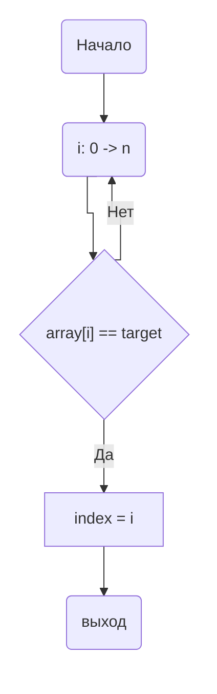
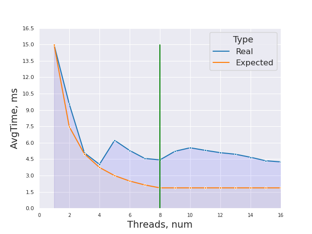
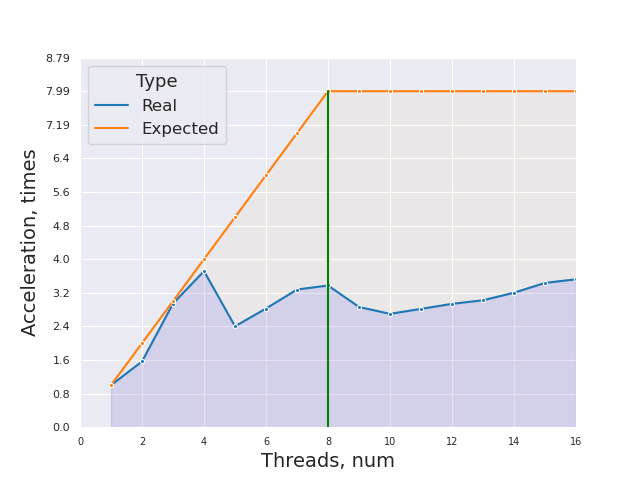
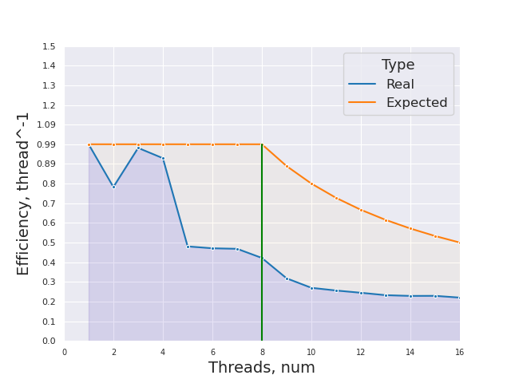

# НИЯУ МИФИ. Лабораторная работа №2. Мищенко Тимофей, Б20-505. 2022

## Система

### Характеристики процессора:
```
CPU:
  Info: quad core model: 12th Gen Intel Core i3-12100F bits: 64 type: MT MCP
    cache: L2: 5 MiB
  Speed (MHz): avg: 2287 min/max: 800/5500 cores: 1: 600 2: 3300 3: 600
    4: 3300 5: 3300 6: 3300 7: 600 8: 3300
```

### Характеристики памяти:
```
Memory:
  RAM: total: 15.47 GiB used: 4.88 GiB (31.5%)
  Array-1: capacity: 32 GiB slots: 2 EC: None
  Device-1: Controller0-ChannelA-DIMM0 type: DDR4 size: 8 GiB speed:
    spec: 2667 MT/s actual: 2666 MT/s
  Device-2: Controller1-ChannelA-DIMM0 type: DDR4 size: 8 GiB speed:
    spec: 2667 MT/s actual: 2666 MT/s
```

### Версия gcc:
```
gcc (GCC) 12.2.0
```

### Версия OpenMP:
```
OpenMP 4.5
```

### Остальные Характеристики
```
6.0.12-arch1-1 x86_64
```

## Оценка алгоритма

### Принцип работы
Приведенный алгоритм итерируется по массиву чисел и сравнивает их с заданным элементом target. Если элемент оказывается равен target то итерация завершается и выводится наименьший номер элемента в массиве через переменную index. Иначе, итерация продолжается. Если элемент не был найден индекс останется равным -1. 

### Блок-схема



### Оценка временной сложности

- Лучший случай: O(1)
- Худший случай: O(n)
- Средний случай: O(n)


### Директивы OpenMP
```c
#pragma omp parallel for shared(array, count, chunk) default(none) private(i) schedule(dynamic, chunk) num_threads(threads)
```

Задается обасть параллельного цикла, с количеством тредов `threads`. Переменные `array`, `count` и `chunk` объявляются общими для всех тредов и непараллельной части алгоритма. Все новые переменные без явного указания класса не разрешены. Цикл выполняется dynamic образом с размером чанка chunk - это значит, что каждый раз когда определенный тред закончит выполнение своей части цикла, ему выдадется новые chunk итераций.
Область - __цикл for генерации массива__.
Эта директива необходима для того, чтобы массив генерировался быстрее.

```c
#pragma omp parallel for shared(array, count, target) default(none) private(i) num_threads(threads) reduction(min: index)
```

Задается обасть параллельного цикла, с количеством тредов threads. Переменные array, count и target объявляются общими для всех тредов и непараллельной части алгоритма. Все новые переменные без явного указания класса не разрешены. Переменная i объявляется индивидуальной для каждого треда. reduction с опцией min - будет выбирать минимальный индекс из каждого, что нашел каждый тред по отдельности.
Область - цикл for
Эта директива необходима для распараллеливания поиска первого индекса и соответственно уменьшения времени его поиска, иначе бы цикл последовательно выполнил count итераций.

### Экспериментальные данные

Среднее время исполнения последовательного алгоритма: 0.00560691 секунд.

#### Среднее время, ускорение и эффективность



Ускорение работы программы по сравнению с однопоточной версией



Эффективность работы программы



## Выводы
На устройстве, на котором проходило тестирование - 4 физических ядра, из-за чего 
вплоть до 4 ядер ожидаемое время исполнения совпадает с экспериментальными данными. На 5 потоках мы видим резкое уменьшение эффективности,
которое не будет сглажено. Вероятно из-за cache miss'ов.

## Исходный код

### Последовательная версия
```c 
#include <omp.h>
#include <stdio.h>
#include <stdlib.h>

void new_array(int *, unsigned int *, int);

void new_array(int *array, unsigned int *random_seed, int count) {
  srand(*random_seed);
  int i;
  int chunk = count / 16;
  int threads = 16;
#pragma omp parallel for shared(array, count, chunk) default(none) private(i)  \
    schedule(dynamic, chunk) num_threads(threads)
  for (i = 0; i < count; i++) {
    array[i] = rand();
  }
  *random_seed += rand();
}

int main() {
  const int count = 10000000;
  unsigned int random_seed = 920214;
  const int num_exp = 20;

  int *array = 0;
  int index;

  srand(random_seed);

  array = (int *)malloc(count * sizeof(int));

  int target;
  double t1, t2, res = 0.0;

  for (int i = 0; i < num_exp; i++) {
    printf("started array\n");
    new_array(array, &random_seed, count);
    printf("ended array\n");
    target = array[rand() % count];
    t1 = omp_get_wtime();
    index = -1;
    for (int i = 0; i < count; i++) {
      if (array[i] == target) {
        index = i;
        break;
      }
    }
    t2 = omp_get_wtime();
    res += t2 - t1;
  }
  res /= (double)(num_exp);
  printf("Average time: %g\n", res);

  free(array);
  return (0);
}
```

### Параллельная версия
```c 
#include <omp.h>
#include <stdio.h>
#include <stdlib.h>
#include <time.h>

void new_array(int *, unsigned int *, int);

void new_array(int *array, unsigned int *random_seed, int count) {
  srand(*random_seed);
  int i;
  int threads = 16;
  int chunk = count / threads;
#pragma omp parallel for shared(array, count, chunk) default(none) private(i)  \
    schedule(dynamic, chunk) num_threads(threads)
  for (i = 0; i < count; i++) {
    array[i] = rand();
  }
  *random_seed += rand();
}

int main() {
  const int count = 10000000;
  unsigned int random_seed = 920214;
  const int num_exp = 20;
  const int thread_bound = 100;

  int **arrays = NULL;
  int *array = NULL;
  int index, i, target, threads;

  double t1, t2, res;

  arrays = (int **)calloc(num_exp, sizeof(int *));
  for (int t = 0; t < num_exp; t++) {
    array = (int *)calloc(count, sizeof(int));
    new_array(array, &random_seed, count);
    arrays[t] = array;
  }

  for (threads = 1; threads <= thread_bound; threads++) {
    fprintf(stderr, "curthreads: %d\n", threads);
    res = 0.0;
    for (int j = 0; j < num_exp; j++) {
      target = arrays[j][rand() % count];
      index = count + 1;

      t1 = omp_get_wtime();
#pragma omp parallel for shared(arrays, count, target, j) default(             \
    none) private(i) num_threads(threads) reduction(min                        \
                                                    : index)
      for (i = 0; i < count; i++) {

        if (arrays[j][i] == target) {
          index = i;
        }
      }
      t2 = omp_get_wtime();
      res += t2 - t1;
    }
    res /= (double)(num_exp);
    fprintf(stdout, "(%d, %g), ", threads, res);
  }

  for (int t = 0; t < num_exp; t++) {
    free(arrays[t]);
  }
  free(arrays);
  return (0);
}
```


