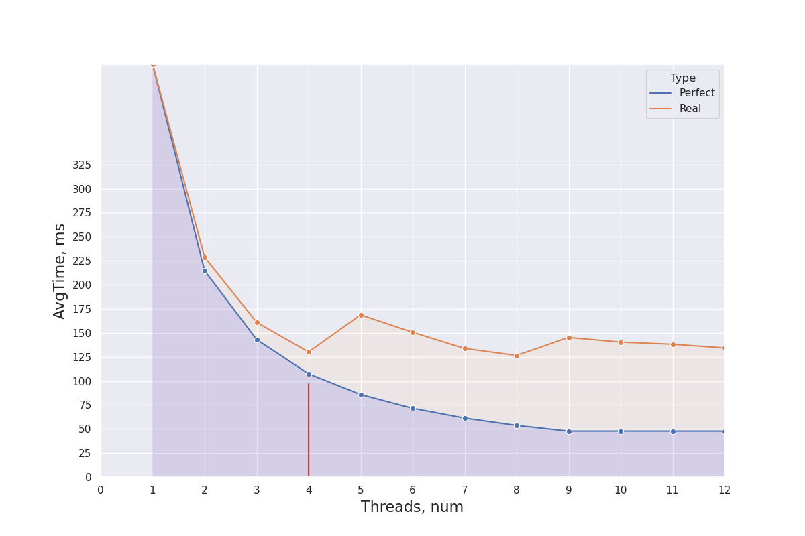
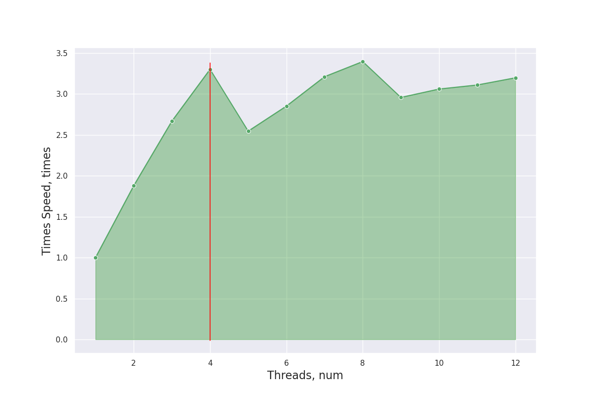
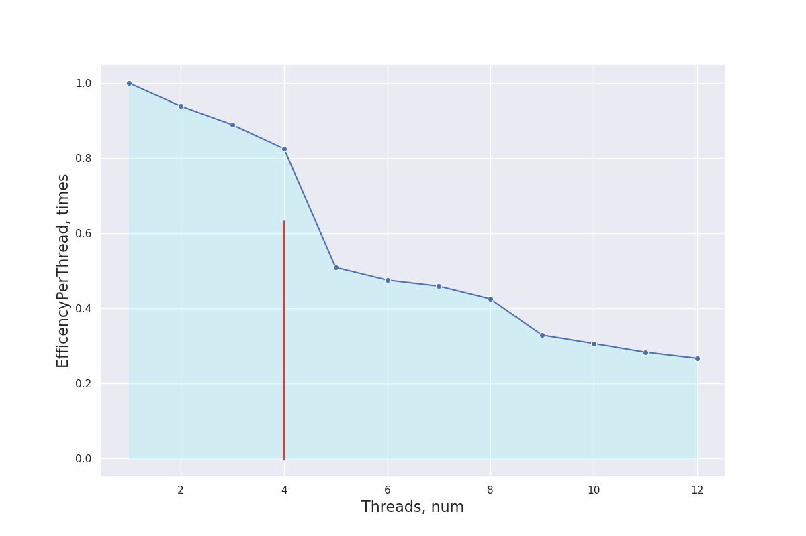

# НИЯУ МИФИ. Лабораторная работа №3. Мищенко Тимофей, Б20-505. 2022

## Система

### Характеристики процессора:
```
CPU:
  Info: quad core model: 12th Gen Intel Core i3-12100F bits: 64 type: MT MCP
    cache: L2: 5 MiB
  Speed (MHz): avg: 1942 min/max: 800/5500 cores: 1: 538 2: 3300 3: 600
    4: 600 5: 3300 6: 3300 7: 3300 8: 600
```

### Характеристики памяти:
```
Memory:
  RAM: total: 15.47 GiB used: 5.82 GiB (37.6%)
  Array-1: capacity: 32 GiB slots: 2 EC: None
  Device-1: Controller0-ChannelA-DIMM0 type: DDR4 size: 8 GiB speed:
    spec: 2667 MT/s actual: 2666 MT/s
  Device-2: Controller1-ChannelA-DIMM0 type: DDR4 size: 8 GiB speed:
    spec: 2667 MT/s actual: 2666 MT/s
```

### Версия gcc:
```
gcc (GCC) 12.2.0
```

### Версия OpenMP:
```
OpenMP 4.5
```

### Остальные Характеристики
```
6.0.12-arch1-1 x86_64
```

## Оценка алгоритма

### Оценка временной сложности

- Лучший случай: $O(\displaystyle\frac{n \log{n}}{p})$
- Худший случай: $O(\displaystyle\frac{n^2}{p})$


### Экспериментальные данные

#### Среднее время, ускорение и эффективность



Ускорение работы программы по сравнению с однопоточной версией



Эффективность работы программы



## Выводы
На устройстве, на котором проходило тестирование - 4 физических ядра, из-за чего вплоть до 4 ядер ожидаемое время исполнения совпадает с экспериментальными данными. На 5 потоках мы видим резкое уменьшение эффективности,
которое не будет сглажено.

## Исходный код

```c 
#include <stdio.h>
#include <stdlib.h>
#include <omp.h>

#define MROWS 100

void InsertSort(int *arr, int i, int length,  int half){
  int temp = 0;
  int j = 0;

  for (int f = half + i; f < length; f = f + half)
  {
    j = f;
    while(j > i && arr[j-half] > arr[j])
    {
      temp = arr[j];
      arr[j] = arr[j-half];
      arr[j-half] = temp;
      j = j -half;
    }
  }
}

double shellSortParallel(int *array, int length, int cur_threads)
{
  int h;
  int j = 0;
  int temp = 0;
  int i = 0;
  for(h =length/2; h > 0; h = h/2)
  {
    #pragma omp parallel for num_threads(cur_threads) shared(array, length, h, i)  default(none)
    for( i = 0; i < h; i++)
    {
      InsertSort(array, i, length, h);
    }
  }
}


int main(int argc, char** argv)
{
    const int count = 1000000;         ///< Number of array elements
    const int random_seed = 31337; ///< RNG seed

    int** matrix = 0;               ///< The array we need to find the max in
    srand(random_seed);
    double start, end;

    /* Generate the random MATRIX */
    matrix = (int**)calloc(MROWS, sizeof(int*));
    for (int i = 0; i < MROWS; i++) {
        matrix[i] = (int*)calloc(count, sizeof(int));
    }
    for (int i = 0; i < MROWS; i++) {
        for (int elem = 0; elem < count; elem++) {
            matrix[i][elem] = rand();
        }
    }

    char filename[50];
    sprintf(filename, "trace.txt");
    FILE *fp = fopen(filename, "w");
    if (fp == NULL) {
        printf("Can't open file\n");
        exit(1);
    }
    int threads = omp_get_max_threads() * 2;

    for (int thread = 1; thread <= threads; thread++) {
        printf("<--- START FOR %d THREADS --->\n", thread);
        // create matrix for each thread

        for (int row = 0; row < MROWS; row++) {
            int *curr_arr = calloc(count, sizeof(int));
            for (int i = 0; i < count; i++) {
                curr_arr[i] = matrix[row][i];
            }
            start = omp_get_wtime();
            
            shellSortParallel(curr_arr, count, thread);

            end = omp_get_wtime();
            if (row != MROWS - 1) {
                fprintf(fp, "%f;", end-start);
            } else {
                fprintf(fp, "%f\n", end-start);
            }
            // for (int i = 0; i < count; i ++) {
            //     printf("%d | ", curr_arr[i]);
            // }
            free(curr_arr);
        }
    }
    fclose(fp);
    printf("Exit...\n");
    return(0);
}
```

