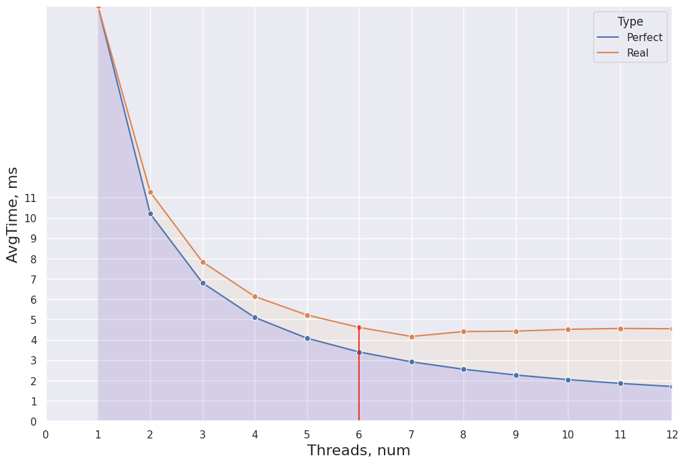
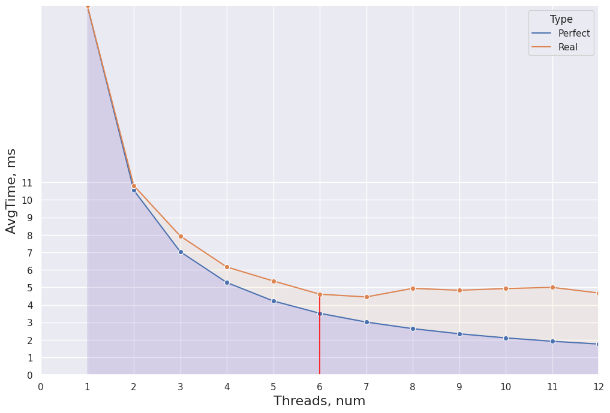
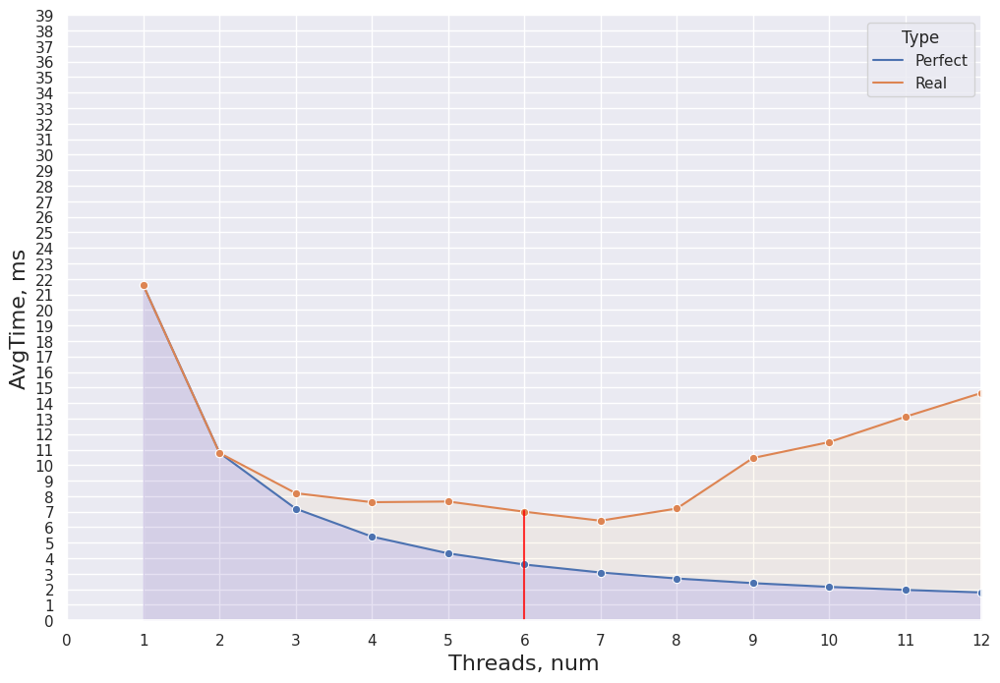
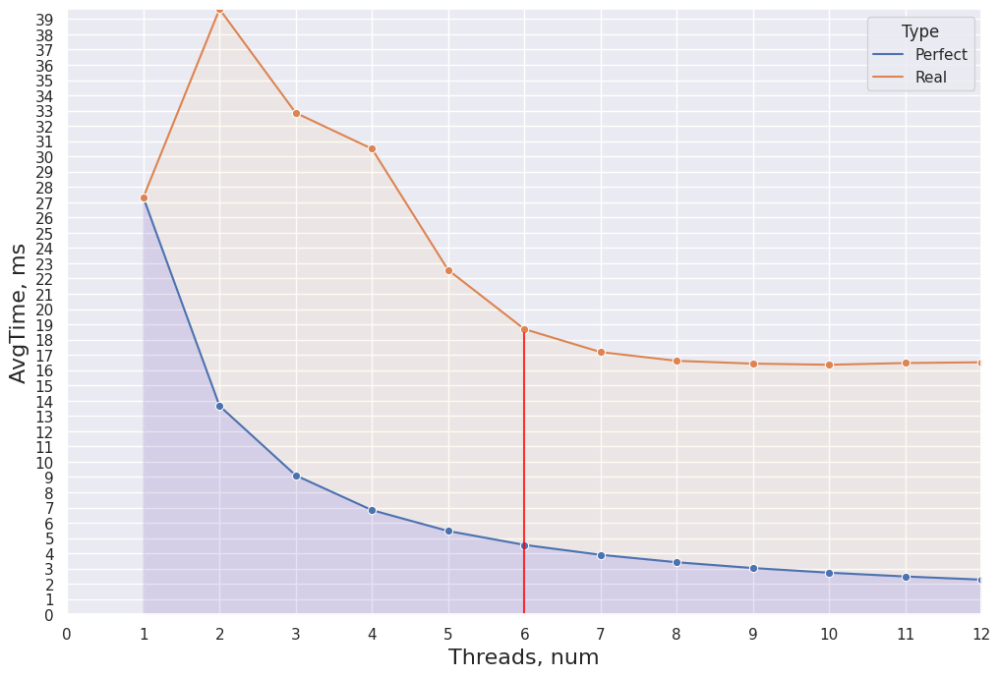
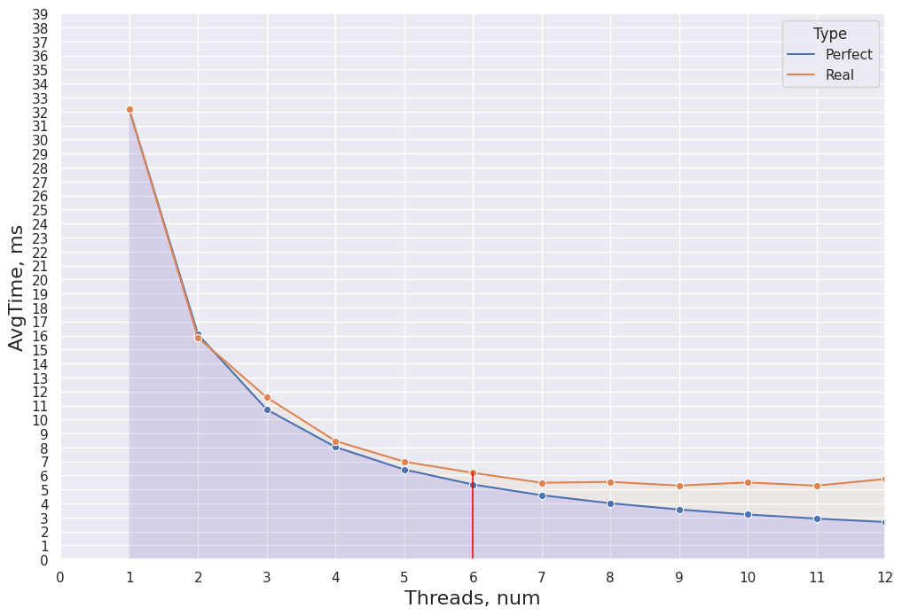

# НИЯУ МИФИ. Лабораторная работа №4. Мищенко Тимофей, Б20-505. 2022

## Ход работы

1. Определить дату принятия используемого стандарта OpenMP

```c
#include <omp.h>
#include <stdio.h>

int main() {
	printf("Date: %d\n", _OPENMP);

}
```

Output: `Date: 201511`

2. Использовать функции omp get num procs() и omp get max threads() для определения числа до-
ступных процессоров и потоков. Вывести результат
```c
#include <omp.h>
#include <stdio.h>

int main() {
	int n_proc = omp_get_num_procs();
	int n_threads = omp_get_max_threads();

	printf("N procs: %d, max threads: %d\n", n_proc, n_threads);
}
```

Output: `N procs: 8, max threads: 8`

3. Выяснить и описать назначение опции `dynamic`. Определить её состояние при помощи функции `omp_get_dynamic()`. Вывести результат

`dynamic` - параметр показывает возможно ли динамически, во время исполнения программы настраивать количество потоков в параллельных областях.

4. Определить разрешение таймера при помощи omp get wtick(). Вывести результат с указанием единицы измерения

`OMP_TICKRATE` - 0.000000001 в миллисекундах.

5. Уточнить особенности работы со вложенными параллельными областями в OpenMP. Определить
текущие настройки среды при помощи функций `omp_get_nested()` и `omp_get_max_active_levels()` и вывести на экран.

```
NESTED = omp_get_nested(); # = 0
MAX_ACTIVE_LEVES = omp_get_max_active_levels(); # = 1
```

NESTED - определяет включен ли вложенный параллелизм (0 => выключен).
MAX_ACTIVE_LEVES - значение MAX_ACTIVE_LEVELS, которая показывает максимальное количество вложенных параллельных областей (= 1).

6. Уточнить особенности распределения нагрузки в среде OpenMP. Получить текущие настройки среды с использованием функции omp_get_schedule() и вывести их на экран

`omp_get_schedule` возвращает тип используемого `schedule` (`static`/`dynamic`/`guided`...), и установленный размер блока

```
SCHEDULE - 1
schedule=dynamic, chunk_size=1
```

7. Разработать пример вычислительного алгоритма, использующего механизм явных блокировок
(`omp_set_lock()`). Обосновать необходимость использования блокировки.

Разработан простейший алгоритм-счетчик с использованием блокировок:

```cpp
	std::cout << "\n===== Task 7 =====" << std::endl;
	int goal = 0;
	int thread = 500;

	omp_lock_t lock;
	omp_init_lock(&lock);

	#pragma omp parallel num_threads(thread)
	{
		omp_set_lock(&lock);
		goal++;
		omp_unset_lock(&lock);
	}

	printf("GOAL == %d\n", goal);
```

В данном алгоритме переменная goal должна увеличиваться на 1 с каждой итерацией. Ожидаемый результат `goal = thread = 500`, что и получается. Если убрать явные блокировки, то результат становиться непостоянным (может получиться 497, 495...) так как операция инкремента не атомарная.

7. Сделано на основе лабораторной работы #2.

Размер чанка == 10_000.

#### Static, 10k


#### Dynamic, 10k



#### Guided, 10k




Размер чанка == 10.

#### Static, 10




#### Dynamic, 10




#### Guided, 10




#### Выводы

**Dynamic** - динамическое распределение итераций с фиксированным размером блоков. Чувствительно к слишком малому размеру чанка.

**Staic** - опция по умолчанию. 

**Guided** - схож с dynamic, но размер блока пропорционален количеству не назначенных итераций, не чувствителен к неверному выбору размера чанка.

## Заключение

В данной работе исследовались основные настройки среды OpenMP и связанных с ними возможностей. Был рассмотрел механизм явных блокировок, а также разработан примитивный алгоритм для демонстации их работы. Также были рассмотрены различные схемы распределения нагрузки schedule и проведен эксперимент на основании лабораторной работы #2.
