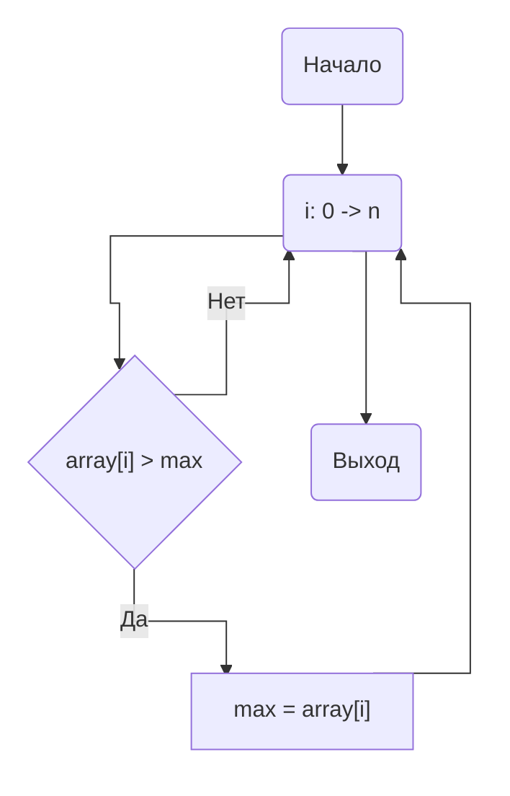
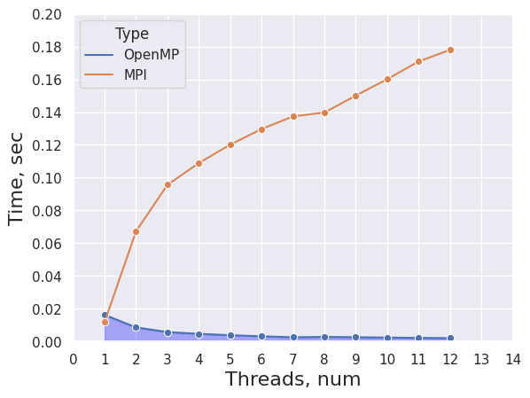
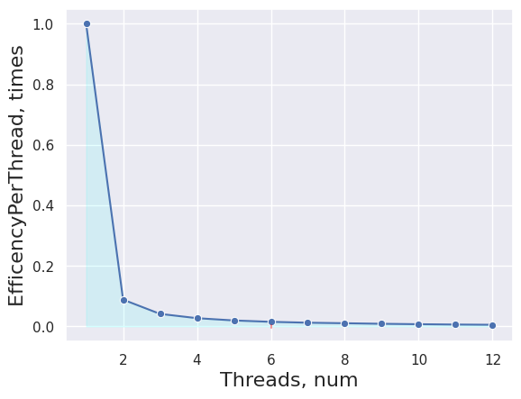
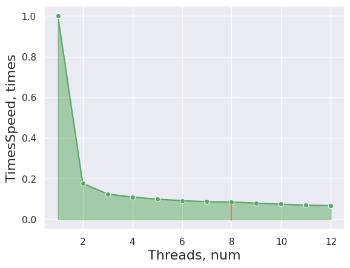

# НИЯУ МИФИ. Лабораторная работа №5. Мищенко Тимофей, Б20-505. 2022

## Система

### Характеристики процессора:
```
CPU:
  Info: quad core model: 12th Gen Intel Core i3-12100F bits: 64 type: MT MCP
    cache: L2: 5 MiB
  Speed (MHz): avg: 2962 min/max: 800/5500 cores: 1: 600 2: 3300 3: 3300
    4: 3300 5: 3300 6: 3300 7: 3300 8: 3300
```

### Характеристики памяти:
```
Memory:
  RAM: total: 15.47 GiB used: 6.41 GiB (41.4%)
  Array-1: capacity: 32 GiB slots: 2 EC: None
  Device-1: Controller0-ChannelA-DIMM0 type: DDR4 size: 8 GiB speed:
    spec: 2667 MT/s actual: 2666 MT/s
  Device-2: Controller1-ChannelA-DIMM0 type: DDR4 size: 8 GiB speed:
    spec: 2667 MT/s actual: 2666 MT/s
```

### Версия gcc:
```
gcc (GCC) 12.2.0
```

### Версия OpenMPI:
```
mpirun (Open MPI) 4.1.4

Report bugs to http://www.open-mpi.org/community/help/
```

### Остальные Характеристики
```
6.0.12-arch1-1 x86_64
```

## Оценка алгоритма

### Оценка временной сложности

$O(\displaystyle\frac{n}{p})$, n - количество элементов массива, p - количество потоков.

### Блок-схема



### Экспериментальные данные

#### Время исполнения в сравнении с лабораторной #1



#### Эффективность на поток



#### Ускорение на поток



## Выводы

Ознакомлен с технологией MPI. Была настроена рабочая среда, оценены метрики работы программы в зависимости от числа потоков. Проведен сравнительный анализ с аналогичной по задаче лабораторной работой #1, использующей технологию OpenMP.

Из-за высокого оверхеда в связи с необходимостью обмениваться сообщениями между рабочими процессами, использование OpenMPI для решения такой задачи не целесообразно. 

## Исходный код

```c 
#include <mpi.h>
#include <stdio.h>
#include <stdlib.h>

#define MROWS 100

int main(int argc, char **argv) {
  int ret = -1;  ///< For return values
  int size = -1; ///< Total number of processors
  int rank = -1; ///< This processor's number

  const int count = 1000000; ///< Number of array elements
  // printf("DEFAULT VALUE - %d\n\n", DEBUG);
  const int RANDOM_SEED = 1337; ///< RNG seed

  int *array = 0; ///< The array we need to find the max in
  int lmax = -1;  ///< Local maximums
  int max = -1;   ///< The maximal element

  double end, start;

  // * GENERATE TRACEFILE
  char filename[50];
  sprintf(filename, "trace.txt");
  FILE *fp = fopen(filename, "a");
  if (fp == NULL) {
    printf("Can't open file\n");
    exit(1);
  }

  /* Initialize the MPI */
  ret = MPI_Init(&argc, &argv);
  if (!rank) {
    printf("MPI Init returned (%d);\n", ret);
  }

  /* Determine our rankand processor count */
  MPI_Comm_size(MPI_COMM_WORLD, &size);
  // printf("MPI Comm Size: %d;\n", size);
  MPI_Comm_rank(MPI_COMM_WORLD, &rank);
  // printf("MPI Comm Rank: %d;\n", rank);

  /* Allocate the array */
  array = (int *)malloc(count * sizeof(int));

  // ! Master generates the array */
  if (!rank) {
    /* Initialize the RNG */
    srand(RANDOM_SEED);
    /* Generate the random array */
    for (int i = 0; i < count; i++) {
      array[i] = rand();
    }
  }

  start = MPI_Wtime();

  // printf("Processor #%d has array: ", rank);
  // for (int i = 0; i < count; i++) { printf("%d ", array[i]); }
  // printf("\n");

  /* Send the array to all other processors */
  MPI_Bcast(array, count, MPI_INTEGER, 0, MPI_COMM_WORLD);

  // printf("Processor #%d has array: ", rank);
  // for (int i = 0; i < count; i++) { printf("%d ", array[i]); }
  // printf("\n");

  const int wstart = (rank)*count / size;
  const int wend = (rank + 1) * count / size;

  // printf("Processor #%d checks items %d .. %d;\n", rank, wstart, wend - 1);

  for (int i = wstart; i < wend; i++) {
    if (array[i] > lmax) {
      lmax = array[i];
    }
  }

  // printf("Processor #%d reports local max = %d;\n", rank, lmax);

  MPI_Reduce(&lmax, &max, 1, MPI_INTEGER, MPI_MAX, 0, MPI_COMM_WORLD);

  end = MPI_Wtime();
  ret = MPI_Finalize();
  // if (!rank) {
  // 	printf("*** Global Maximum is %d;\n", max);
  // }

  fprintf(fp, "%lf;", end - start);
  // printf("MPI Finalize returned (%d);\n", ret);

  return (0);
}
```

