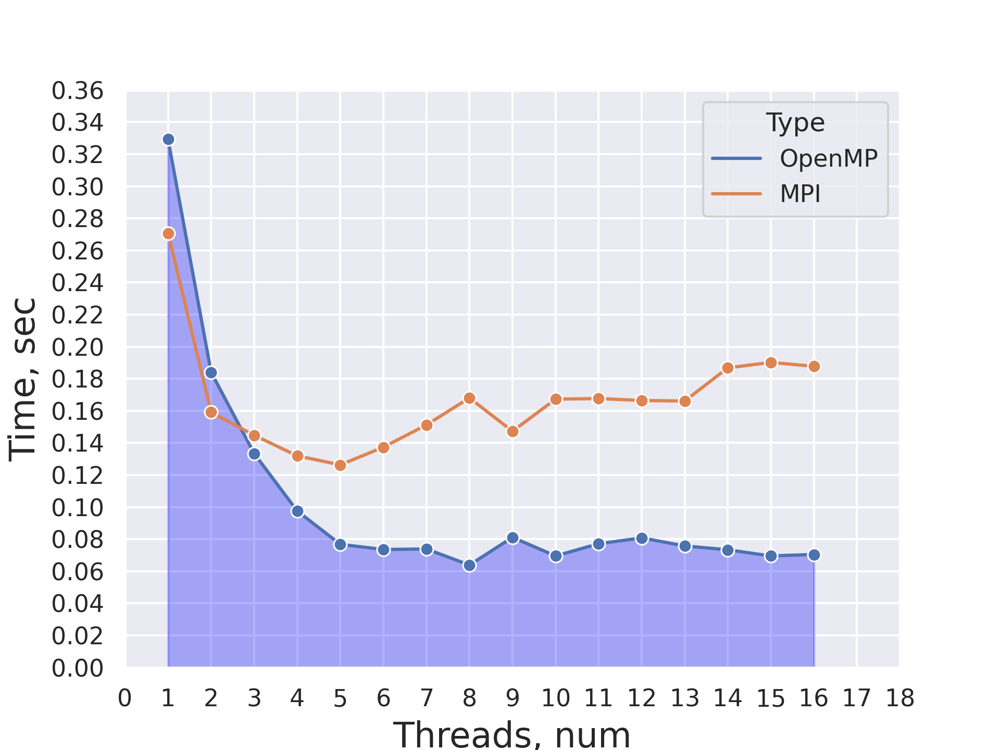
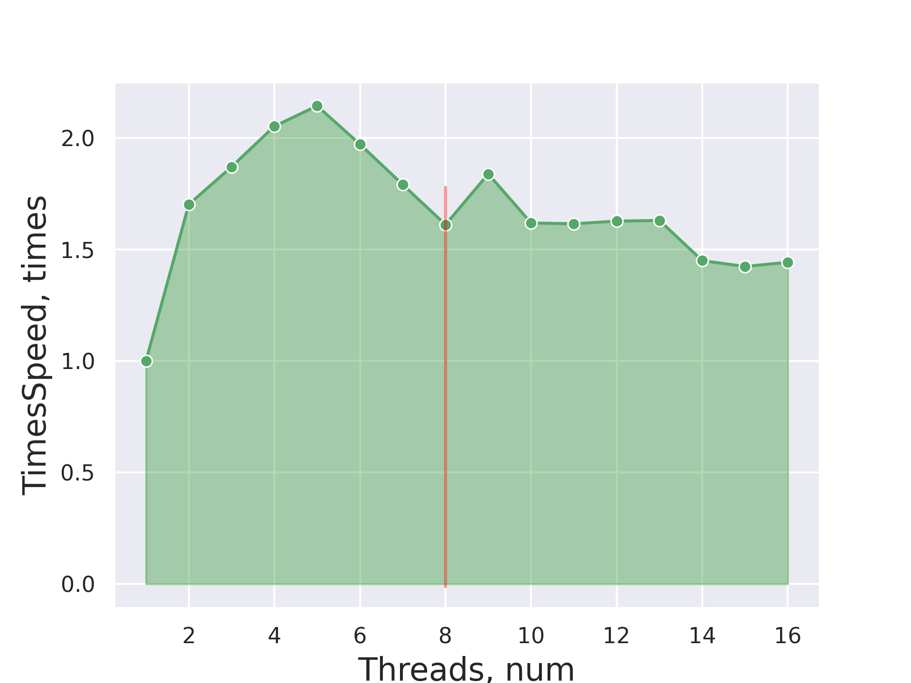
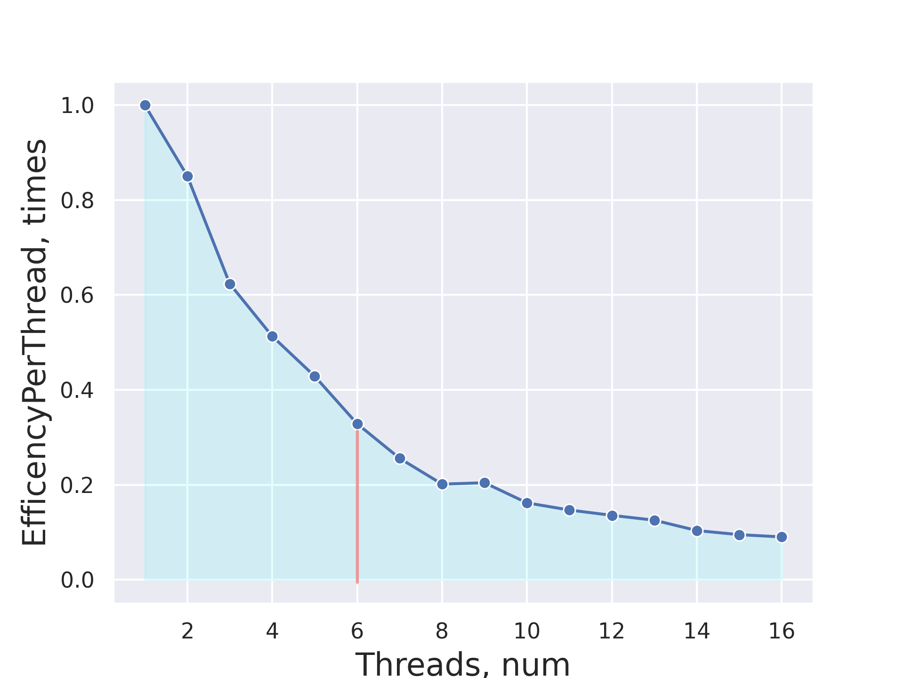

# НИЯУ МИФИ. Лабораторная работа №6. Мищенко Тимофей, Б20-505. 2022

## Система

### Характеристики процессора:
```
CPU:
  Info: quad core model: Intel Core i5-8265U bits: 64 type: MT MCP cache:
    L2: 1024 KiB
  Speed (MHz): avg: 1113 min/max: 400/3900 cores: 1: 1800 2: 700 3: 1800
    4: 710 5: 700 6: 700 7: 700 8: 1800
```

### Характеристики памяти:
```
Memory:
  RAM: total: 15.32 GiB used: 8.92 GiB (58.2%)
  Array-1: capacity: 32 GiB slots: 2 EC: None
  Device-1: ChannelA-DIMM0 type: DDR4 size: 8 GiB speed: spec: 2667 MT/s
    actual: 2400 MT/s
  Device-2: ChannelB-DIMM0 type: DDR4 size: 8 GiB speed: spec: 2667 MT/s
    actual: 2400 MT/s
```

### Версия gcc:
```
gcc (GCC) 12.2.0
```

### Версия OpenMPI:
```
mpirun (Open MPI) 4.1.4

Report bugs to http://www.open-mpi.org/community/help/
```

### Остальные Характеристики
```
6.1.1-arch1-1 x86_64
```

### Обзор алгоритма
Общая концепция сортировки оболочки заключается в сравнении пар значений, расположенных достаточно далеко друг от друга в наборе значений, подлежащих упорядочению на начальных этапах сортировки (сортировка таких пар требует, как правило, большого количества операций перестановки, если сравниваются только соседние элементы):  
– На первом шаге алгоритма сортируются элементы $\frac{n}{2}$ пар $(a_{i}, a_{\frac{n}{2}+i})$ для $1 ≤ i ≤ \frac{n}{2}$  
– На втором шаге элементы в $\frac{n}{4}$ группах из четырех элементов $(a_{i}, a_{\frac{n}{4}+ 1}, a_{\frac{n}{2} + 1}, a_{\frac{3n}{4} +1})$ для $1 ≤ i ≤ \frac{n}{4}$ сортируются и т.д.  
– На последнем шаге сортируются элементы всего массива $(a_{1}, a_{2},..., a_{n})$

Общее число итераций алгоритма оболочки равно $log_{2}n$.

Таким образом, shell sort улучшает сортировку вставками, разбивая исходный список на несколько более мелких подсписков, каждый из которых сортируется с использованием сортировки вставками.  
Вместо разбиения списка на подсписки смежных элементов сортировка оболочки использует переменную i, иногда называемое интервалом, для создания подсписка путем выбора всех элементов, разделенных i элементами.

При последовательном shell sort сложность вычислений составляет $O(nlog_2 n)$.
Общая оценка ускорения и эффективности при параллельном вычислении составляет $S_{p} = \displaystyle\frac{nlog_{2}{n}}{\frac{n}{p}log_{2}(\frac{n}{p}) + 2n}$, $E_{p} = \displaystyle\frac{nlog_{2}n}{p(\frac{n}{p}log_{2}\frac{n}{p} + 2n)}$ 

### Экспериментальные данные

#### Время исполнения в сравнении с лабораторной #3



#### Эффективность на воркера



#### Ускорение на воркера



## Выводы

Был реализован алгоритм сортировки Шелла на MPI и проведено очередное сравнение реализаций на MPI и OpenMP. В ходе экспериментов было выяснено, что в данной задаче OpenMP работает быстрее, чем MPI.

Видимо оверхед на пересылку сообщений все еще выше. Вероятно, такие задачи как поиск простых чисел на отрезке покажут результат лучше, так как затраты на перессылку сообщений минимальны. 

## Исходный код

```c 
#include <iostream>
#include <cstdlib>
#include <time.h>
#include "mpi.h"

using namespace std;

void shellSort(int* arr, int n)
{
    int stride = 0;
    for (stride = 1; stride < n / 3; stride = stride * 3 + 1);
    while(stride > 0)
    {
        for (int i = stride; i < n; i++)
        {
            int temp = arr[i];
            int j;
            for (j = i; j >= stride && arr[j - stride] > temp; j -= stride)
                arr[j] = arr[j - stride];

            arr[j] = temp;
        }
        stride = (stride - 1)/3;
    }
}


int main(int argc, char **argv) {
    int size, rank, arraySize = 1000000;
    int *array = new int[arraySize];
    const int random_seed = 920224;
    MPI_Status status;

    MPI_Init(&argc, &argv);
    MPI_Comm_size(MPI_COMM_WORLD, &size);
    MPI_Comm_rank(MPI_COMM_WORLD, &rank);

    srand(random_seed);

    if (rank == 0) {
        for (int i = 0; i < arraySize; i++) {
            array[i] = (rand() +rand() * RAND_MAX ) / 40;

        }
    }

    int *subArray;
    int n = arraySize / size;
    double begin;
    double end;

    if (rank == 0) {

        for (int i = 1; i < size; i++) {
            MPI_Send(array + n * (i - 1), n, MPI_INT, i, 0, MPI_COMM_WORLD);
        }

        begin = MPI_Wtime();
        int k = arraySize - n * (size - 1);
        subArray = new int[k];

        for (int i = n * (size - 1); i < arraySize; i++) {
            subArray[i - n * (size - 1)] = array[i];
        }
        shellSort(subArray, k);
        int *rArray = new int[arraySize];
        for (int i = 0; i < k; i++) {
            rArray[i] = subArray[i];
        }
        for (int i = 1; i < size; i++) {
            MPI_Recv(rArray + n * (i - 1) + k, n, MPI_INT, MPI_ANY_SOURCE, 1, MPI_COMM_WORLD, &status);
        }
        shellSort(rArray, arraySize);
        end = MPI_Wtime();
        cout << "" << (end - begin) << std::endl;
    }
    else
    {
        subArray = new int[n];
        MPI_Recv(subArray, n, MPI_INT, 0, 0, MPI_COMM_WORLD, &status);
        shellSort(subArray, n);
        MPI_Send(subArray, n, MPI_INT, 0, 1, MPI_COMM_WORLD);
    }

    MPI_Finalize();

    return 0;
}
```

